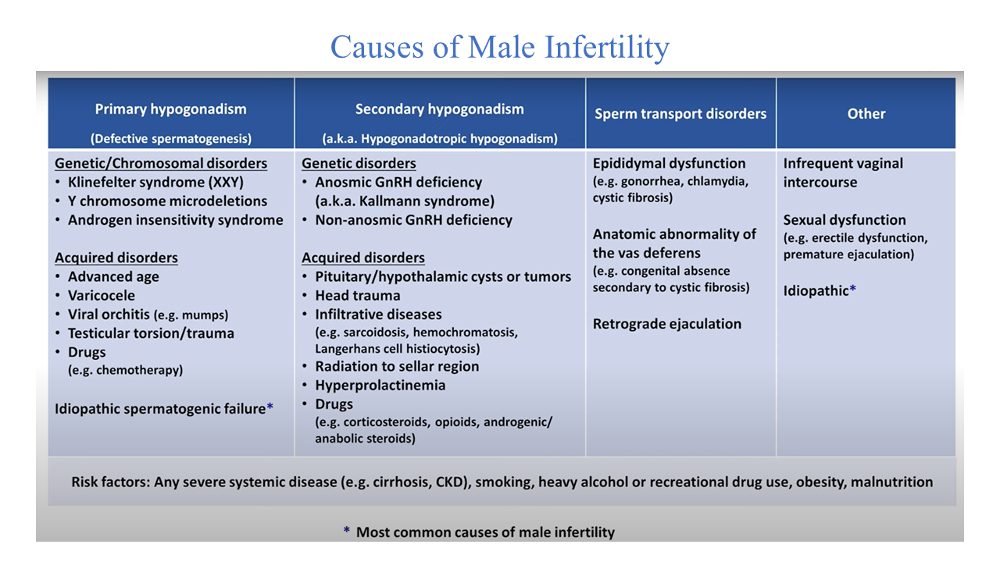

# male\_infertility data analysis
CodeYou data analysis capstone-project, 2025
## Project by dj samuelson
  
Most causes of male infertility are unknown or idopathic.

## About the Project
Aim 1 is to investigate a popular hypothesis that male infertility is associated with poor general health or other health problems.

Aim 2 is to analyze biological data from the visem project to identify molecular signatures of male infertility.

## Running the Program
1. Python 3 is required. This project is written using version 3.13.
2. Clone the repo from github.
3. Setup a virtual environment and activate it.
4. To make sure you have all the necessary packages, run

"pip install -r requirements.txt". 

 The following packages will be required to run the program: 
- pandas, 
- numpy, 
- matplotlib.pyplot, 
- seaborn  

5. Use VS Code or another capable app to run the Jupyter Notebook "../notebooks/capstone.ipynb" file for this project.  

## Project Requirements
Following is a brief description of how data-analysis capstone-project-requirements have been met 

** Environment & Dependendencies
- a virtual environment was used for this project.
- a requirments.txt file is included in the github repo

** Data Ingestion & Cleaning
- local .csv files were used. These data were downloaded from various sources, including the cdc and kaggle.
- Exploratory data analysis (EDA) was performed on multiple files to determine which databases were a good fit for this project. This EDA work can be found in the "../notebooks/capstone_EDA.ipynb" file. This phase of the projcet yielded three project-appropriate and one -inappropriate datasets. Two of the appropriate datasets were used in the next phase, which was "data analysis and visualization" in "../notebooks/capstone.ipynb".

** Feature Engineering & Functions
- new columns were created based on existing data. For example, new columns with human readable descriptions were created from columns containing arbitray categorical data.
- custom functions were used to reclassify existing number-based data into human readable classifications  

** Database Integration
- cleaned data, after EDA, was stored as .csv files and two of these files were used in "../notebooks/capstone.ipynb" for data visualization
- multiple biological databases were merged based on primary key, ID, to make the "../data/male_fertility_mol_sig.csv" file used in "../notebooks/capstone.ipynb". The merge used pandas and can be found in "../notebooks/capstone_EDA.ipynb".

** Data Visualization
    at least 3 plots each a different type were made using seaborn, including count, violin/swarm, and heatmap plots
        all plots include a title, clearly labeled axes, and unified color themes

## Data Analysis Conclusions 
    # Only two population- and one molecular-based databases that either indirectly or directly related to male factor infertility were found 
        -   Conclusion: There is a derth of data on male factor infertility

    # There was a low number of respondent's that claimed to have received infertility services, which served as a proxy for infertility, compared to those that did not.
        -   Conclusion: Still, it will be worthwile to perform logistic regression analyses of the infertility proxy on health conditions contained in the NSFG database.
     
    # Analysis of the molecular signature data from Visem uncovered evidence of multiple positive and negative correlations between variables.
        -   Conclusion: 1. Worthwhile to revisit this analysis to make seperate plots for each biological category (i.e. corr of hormone levels with sperm measurements). 2. Worthy to integrate gene ontology and pathway analyses with the Visem molecular signatures  

## data dictionaries

- NSFG infertility related:
../data/2022-2023-NSFG-MalePUFCodebook.pdf contains information for National Survey of Family Growth (NSFG) from the CDC

- Infertility and stress:
../data/male_fertility_stress_questions_data.csv

- biological data - molecular signatures from Visem:
../data/visem_data_descriptions.txt contains information for visem molecular signature data

